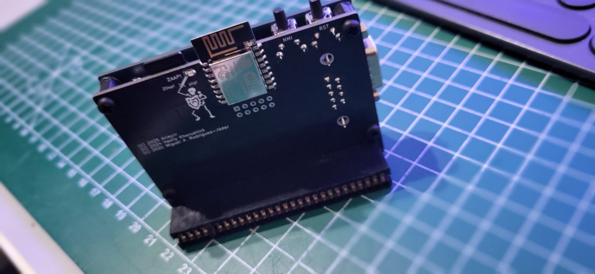

# divtiesus-acer

A custom-PCB fork of **DivTIESUS** — a DivMMC-compatible SD/MMC card interface for the ZX Spectrum.

This fork is a **board re-layout only**: the CPLD firmware and its pinout are unchanged from
upstream, so the existing logic runs on the new PCB without modification.

## Lineage

| Stage | Author | Repo |
|-------|--------|------|
| Original DivTIESUS | Miguel Ángel Rodríguez Jodar (*mcleod-ideafix*) | https://github.com/mcleod-ideafix/divtiesus |
| KiCad redesign ("maple" edition) | anarsoul | https://github.com/anarsoul/divtiesus_maple |
| This fork (`divtiesus-acer`) | — | custom PCB re-layout based on the maple edition |

## What is unchanged from upstream

The entire `cpld/` directory matches the maple edition:

- Same Verilog sources: `tld_divtiesus.v`, `divmmc_mcleod.v`, `modo.v`, `segajoy.v`, `tres_e.v`,
  `uart.v`, `zxunoregs.v`, `zxunouart.v`
- Same `config.vh` and `Makefile`
- Same `tld_divtiesus.qsf` pin map — target device **Altera MAX II `EPM240T100C5`**

Inherited feature set:

- DivMMC-compatible interface with 8 KiB EEPROM and 128 KiB or 512 KiB RAM
- Automatic Spectrum model detection (no jumpers/switches)
- 24 MHz independent clock
- microSD card support with activity LED
- NMI and RESET buttons (file browser access)
- Optional ZX-Uno-compatible UART for WiFi (115200 baud)
- Kempston joystick interface (Atari and Sega controllers)
- Soft +3E feature removed (as in the maple edition)

## License

GPLv3, inherited from the upstream sources (see the GPL headers in `cpld/tld_divtiesus.v` and the
ZX-Uno notice in `cpld/config.vh`).
